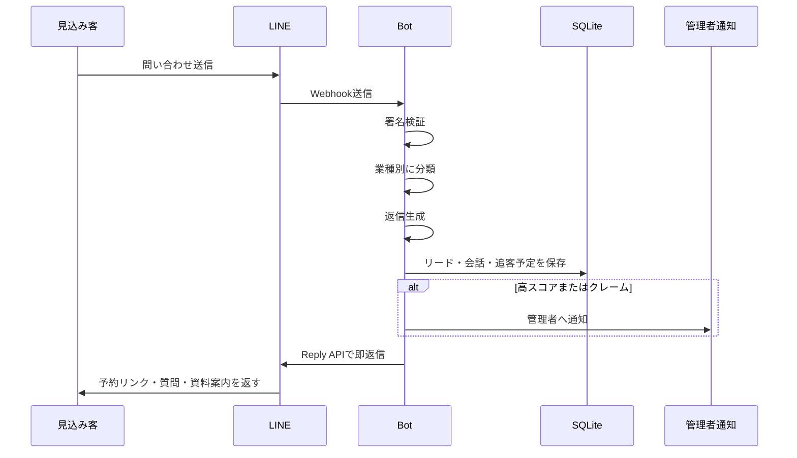

# LINE即レス売上回収Bot


LINE公式アカウントに来た問い合わせへAIが即返信し、来店予約・内見予約・資料請求・無料相談まで自動で進めるための実装済みテンプレートです。

初期費用を先に受け取り、顧客には既存のLINE公式アカウントへWebhookを接続してもらうだけで導入できる構成にしています。

## できること

- LINE Messaging API Webhook受信
- 署名検証
- 問い合わせ分類
- 業種別の返信生成
- OpenAI APIがある場合はAI返信、未設定でもテンプレ返信で稼働
- 予約リンク、資料リンク、電話案内の自動送信
- 見込み度スコアリング
- SQLiteへのリード・会話履歴保存
- 管理者Webhook通知
- 翌日・3日後の追客ジョブ
- 導入フォーム用API
- 管理者向けリード一覧API
- テスト、CI、devcontainer、Docker同梱

## 想定商品

| 商品 | 価格 |
|---|---:|
| 初期設定 | 29,800円 |
| 月額運用 | 9,800円 |
| 上位版 | 月19,800円 |
| 成果報酬オプション | 予約1件あたり500〜2,000円 |

## 全体アーキテクチャ

```mermaid
flowchart TD
    A[見込み客<br>LINE公式アカウントへ問い合わせ] --> B[LINE Messaging API]
    B --> C[FastAPI Webhook<br>/webhook/line]
    C --> D{署名検証}
    D -->|OK| E[分類・見込み度スコア]
    D -->|NG| X[401で拒否]
    E --> F{OpenAI API Keyあり?}
    F -->|あり| G[AI返信生成]
    F -->|なし| H[業種別テンプレ返信]
    G --> I[LINE Reply API]
    H --> I
    E --> J[(SQLite<br>Leads / Messages / Followups)]
    E --> K[重要案件のみ<br>管理者Webhook通知]
    L[cron / GitHub Actions / 外部スケジューラ] --> M[/jobs/followups]
    M --> N[翌日・3日後の追客]
    N --> O[LINE Push API]
```

## 処理の流れ



## 主要ファイル

| パス | 役割 |
|---|---|
| `src/line_revenue_bot/main.py` | FastAPIエントリポイント |
| `src/line_revenue_bot/line_client.py` | LINE署名検証、Reply API、Push API |
| `src/line_revenue_bot/classifier.py` | 問い合わせ分類と見込み度スコア |
| `src/line_revenue_bot/reply_generator.py` | AI返信・テンプレ返信生成 |
| `src/line_revenue_bot/db.py` | SQLite永続化 |
| `static/index.html` | 販売ページ兼デモ導線 |
| `docs/setup.md` | 初期設定ガイド |
| `docs/architecture.md` | 詳細アーキテクチャ |
| `.github/workflows/ci.yml` | lint、test、artifact生成 |
| `.devcontainer/devcontainer.json` | Codespaces開発環境 |

## ローカル起動

```bash
cp .env.example .env
python -m venv .venv
source .venv/bin/activate
pip install -e ".[dev]"
uvicorn line_revenue_bot.main:app --reload
```

ヘルスチェック:

```bash
curl http://localhost:8000/health
```

デモ問い合わせ:

```bash
curl -X POST http://localhost:8000/admin/test-message \
  -H "Content-Type: application/json" \
  -H "X-Admin-Token: dev-token-change-me" \
  -d '{"tenant_id":"demo","user_id":"demo-user","text":"新宿の物件を内見したいです。明日空いていますか？"}'
```

## 本番に必要なもの

最低限必要です。

- HTTPSで公開できる実行環境
- LINE DevelopersのMessaging APIチャネル
- `BOT_LINE_CHANNEL_SECRET`
- `BOT_LINE_CHANNEL_ACCESS_TOKEN`
- 永続化されるSQLiteファイル、または将来的なPostgreSQL移行
- `BOT_ADMIN_API_TOKEN`
- 重要案件通知用の `BOT_ADMIN_WEBHOOK_URL`

AI返信を使う場合は追加で必要です。

- `BOT_OPENAI_API_KEY`
- `BOT_OPENAI_MODEL`

Stripe決済リンクやGoogleフォームはこのBotの外側で使う想定です。決済後にフォーム内容を `/intake/config` へ送ると、顧客別の返信方針を登録できます。

## 環境変数

`.env.example` をコピーして設定します。

| 変数 | 必須 | 説明 |
|---|---:|---|
| `BOT_DATABASE_URL` | 任意 | 既定は `sqlite:///./data/app.db` |
| `BOT_LINE_CHANNEL_SECRET` | 本番必須 | LINE署名検証用 |
| `BOT_LINE_CHANNEL_ACCESS_TOKEN` | 本番必須 | LINE Reply/Push API用 |
| `BOT_LINE_SIGNATURE_VERIFICATION` | 任意 | 本番は `true` |
| `BOT_LINE_REPLY_DRY_RUN` | 任意 | 本番送信時は `false` |
| `BOT_OPENAI_API_KEY` | 任意 | AI返信を使う場合 |
| `BOT_OPENAI_MODEL` | 任意 | 返信生成モデル |
| `BOT_ADMIN_API_TOKEN` | 本番必須 | 管理API保護用 |
| `BOT_ADMIN_WEBHOOK_URL` | 任意 | Slack/Make/Zapier等のWebhook URL |
| `BOT_PUBLIC_BASE_URL` | 任意 | 公開URL |

## LINE側Webhook URL

本番URLが `https://example.com` の場合:

```text
https://example.com/webhook/line
```

LINE DevelopersのMessaging API設定でWebhookを有効化し、このURLを設定します。

## GPT Imageで説明資料を作るためのプロンプト

顧客向けの提案資料や初心者向け導入ガイドを画像化したい場合は、`docs/gpt-image-architecture-prompt.md` のプロンプトをGPT Imageの最新画像生成モデルに貼り付けるだけで、全体像と処理フローを1枚の図にできます。README上ではMermaid図も併記しているため、GitHubだけでも構成を理解できます。

## GitHub Actions

CIは以下を自動実行します。

- Pythonセットアップ
- 依存関係インストール
- Ruff lint
- pytest
- サンプルデータ生成
- CSV artifact出力

成果物はActionsのArtifact `line-bot-sample-outputs` から取得できます。

## 導入後の運用

1. Stripe決済リンクで初期費用を受け取る
2. Googleフォームまたは `/intake/config` に顧客情報を登録
3. LINE DevelopersでWebhook URLを設定
4. 本番環境の `BOT_LINE_REPLY_DRY_RUN=false` に変更
5. `/admin/leads` でリード状況を確認
6. cronで `/jobs/followups` を1時間ごとに実行

## 初期営業文面

```text
LINEの問い合わせ、営業時間中に即返信できていますか？
AIがLINEに即返信して、予約・資料請求・相談まで自動で進めるBotを作っています。
初期29,800円、月9,800円で、まず1社だけテスト導入できます。
決済後、フォーム入力だけで設定できます。
```
